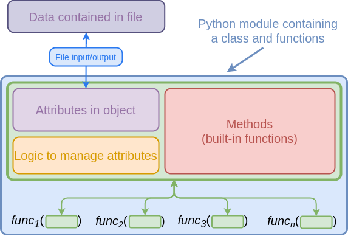
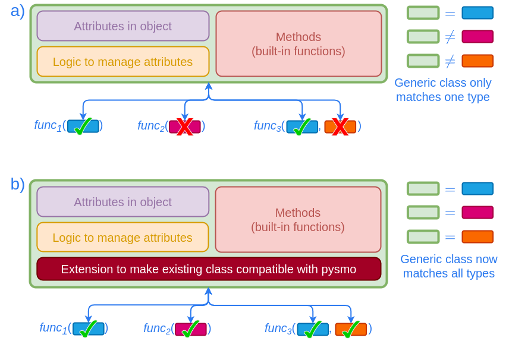

# More on Types

## What is (or isn't) a type?

In short, a pysmo type should represent something that can (for the most part) be
independently measured or observed, rather than being derived from some other type of
data. The aim of this simple rule is to prevent ambiguous relationships between class
attributes leading to inconsistencies creeping into data. For example, one might decide
to define a class for station and event locations, together with the distance and azimuth
between the two locations. Such a class may look something like this:

```python title="example_class.py"
--8<-- "docs/snippets/example_class.py"
```

1.  `some_library` is just a bit of pseudo code. For this example we just assume it
    is some real library that provides us with functions to use in our class.
2.  We assume we initialise an instance with reasonable data, but should probably
    add some tests to verify if the values actually make sense...
3.  We assume the event coordinates stay the same when we change the station
    coordinates and recalculate distance and azimuth.
4.  We assume the station coordinates stay the same when we change the event
    coordinates and recalculate distance and azimuth.
5.  We assume the station coordinates and azimuth stay the same when we change
    distance and recalculate event coordinates.
6.  We assume the station coordinates and distance stay the same when we change
    azimuth and recalculate event coordinates.

It appears then that such a class could certainly be implemented, but we also see a few
potential shortcomings:

- We need to take into account that every time an attribute changes, others need to be
  recalculated. Moreover, we need to decide which attributes are more important than
  others when deciding which ones to change to maintain consistent data.
- It is not a given that the calculations are always performed the same way (e.g. when
  using different reference Earth models for distance and azimuth calculations).
- What if the data we use to create a new instance of this class aren't entirely
  sensible? If they are completely wrong we will probably notice, but if they are off
  only by a small margin (e.g. due to being calculated elsewhere with a different model),
  one might never notice!

Because of these problems, there will never be pysmo type that has the same structure as
the above class! Instead we would either opt for a type consisting of only coordinates,
or one coordinate together with distance and azimuth:

```python title="protocol_options.py"
--8<-- "docs/snippets/protocol_options.py"
```

The attributes used in both protocol classes are independent, and they even could be used
with the `Example`{l=python} class:

```python
>>> my_example = Example(stat_cords, eve_coords, distance, azimuth)
>>> isinstance(my_example, StationEvent)
True
>>> isinstance(my_example, StationDistAzi)
True
```

Me must keep in mind here, that using protocol classes in this way does not magically
remove the problems with the `Example` class discussed above. It is conceivable, for
example, that the same instance of `Example` could be accessed via both `StationEvent`
and `StationDistAzi` simultaneously. Thus the dependencies between the `Example`
attributes are still a concern. While the attributes within `StationEvent` and
`StationDistAzi` may appear independent, the two types as a whole are not. It is
therefore a bad idea to define new types for pysmo with attributes that may not be
independent. Here we would choose either `StationEvent` or `StationDistAzi` to become
new pysmo types, but never both.

!!! note
    The `StationEvent` and `StationDistAzi` types only serve as examples to illustrate
    the problems that arise from dependencies between attributes. Pysmo types are
    not about simplifying existing generic classes. When considering adding a new
    type to pysmo, the starting point is always the type itself. Adding or modifying
    the classes that hold the actual data comes afterwards. Remember that the
    motivation for pysmo types stems from the idea that, while it makes sense to
    group certain attributes together for storage, grouping them together for
    processing in the same way often does not. Consequently neither of the above
    types would realistically be considered for inclusion in pysmo!


## Compatibility with Generic Classes

A typical workflow using any kind of data consists of first reading those data into a
Python object, and then working with the attributes and methods provided by the object.
When reading from a file, the attributes often mirror the way the data are organised
within the file. They are manipulated via the built-in methods or extra functions that
use the entire object as input.

<figure markdown>
  { loading=lazy }
  <figcaption>
    Relationship between Python objects and files storing data.
  </figcaption>
</figure>

So if the data as described by the file format were to contain a variable called `delta`
for storing the sampling rate, the same data will likely be present as an attribute
called `delta`in the Python object. Besides the data, the Python object also needs to
incorporate logic to ensure the formatting and behaviour remains consistent with the
original file format. This is not only to be able to write back to the file, but also
because some variables might not be independent (see [above](#what-is-or-isnt-a-type)).

These kinds of Python classes can be quite sophisticated, and often become the
centrepieces of Python packages. They may even be capable of reading and writing to
several different file formats. As one might imagine, writing and maintaining these
classes is a lot of work, and it does not make much sense to create yet another one for
pysmo.

In order to make use of these existing classes, we must ensure compatibility with the
[pysmo types](../user-guide/types.md). While some types may work out of the box
with an existing class, it is usually necessary to modify the class to work with pysmo
types. Crucially, this requires only a fraction of work compared to writing a data class
from scratch.

<figure markdown>
  { loading=lazy }
  <figcaption>
    (a) An existing generic class may well contain the exact data that are used as
    input for functions. However, as the functions expect those data to be presented
    in a particular way (i.e. they need to match pysmo types), the class is mostly
    incompatible. (b) After extending the generic class (typically simply by mapping
    attributes in the class to attributes in the type via aliases) it becomes
    compatible with more pysmo types, and thus can be used for all the functions.
  </figcaption>
</figure>
