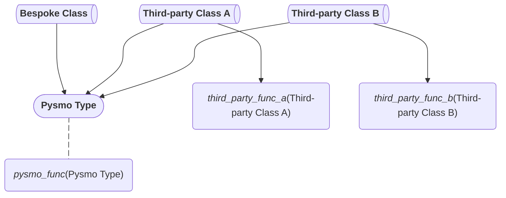

# Frequently asked questions

## What is pysmo?

Pysmo is a Python library for seismology. It defines lightweight
[`Protocol`][typing.Protocol]-based *types* that describe the attributes seismic
data have, without prescribing how those data must be stored. Any class that
matches a pysmo type can be passed to pysmo functions, wherever the class comes
from. A function written against a type works with every conforming class, in
this project or another.

## What does pysmo *not* do?

Pysmo is a library, not a framework. It does not impose a workflow, manage data
downloads, or provide a full processing pipeline. Its scope is deliberately
narrow: define types, and provide functions that operate on them. How data are
stored, where they come from, and how processing is organised are all outside
its scope.

## When is pysmo the best fit?

Pysmo fits best when writing *new* code that should be reusable across projects,
data sources, or storage formats. Once the application-specific classes conform
to pysmo types, the shared processing steps are written once. A function that
does what a project needs may already exist, written earlier or by someone else.

Pysmo types are much smaller than a typical monolithic seismogram class, so
populating one does not require a single file holding everything. Individual
attributes can come from wherever suits: a database, a web service, local files,
or a combination. New data formats need no changes to pysmo itself, only a class
that conforms to the existing types.

## How does pysmo relate to other seismology libraries?

Pysmo complements other tools rather than replacing them. A seismology library
already in use can stay: its classes can be adapted to conform to pysmo types,
which keeps its own functionality available alongside pysmo's typed interfaces.

## Do I need to rewrite my existing code to use pysmo?

No. Pysmo types are `Protocol` classes, so any class with the right attributes
and methods is compatible automatically. There is no pysmo base class to inherit
from. Often a few small adjustments are enough to make an existing class conform
to a pysmo type. Those adjustments are additive, so they do not break code that
already uses the class. The diagram below shows the result: a bespoke class and
two third-party classes all conform to one pysmo type and work with any function
that accepts it, while the third-party classes keep working with their own
functions.

## Is pysmo complicated?

There is a learning curve at first. Once the core ideas are familiar, the
day-to-day work gets easier: the editor can autocomplete attributes and flag
type mismatches before the code runs. Pysmo builds on standard Python: type
hints, `Protocol` classes, and dataclasses. None of these are pysmo-specific.
They are part of modern Python and are used widely across the ecosystem.

!!! tip "Pysmo uses advanced typing features"

    Pysmo uses typing features that go beyond basic annotations. Python's type
    system has advanced considerably in recent versions, and pysmo relies on that. A
    full understanding of these features is not required to use pysmo, but they are
    why the editor or type checker can catch errors before the code runs. The
    [first steps](index.md) page and the [tutorial](tutorial.md) introduce them step
    by step.

## Does pysmo enforce types at runtime?

No. Pysmo uses Python's type hints, which are checked *statically* by tools like
[mypy](https://mypy.readthedocs.io) or the editor, not at runtime. Python itself
will still run code that passes the wrong type to a function, but the type
checker flags it first. For runtime validation, pair pysmo with a library like
[attrs](https://www.attrs.org) or [pydantic](https://docs.pydantic.dev).

!!! note "Static types vs runtime validation"

    Pysmo *types* do no runtime checking, but some of the classes and functions
    shipped with pysmo do validate their inputs. The types define an interface for
    static analysis; the concrete implementations may enforce constraints when used.

## What if no pysmo type fits my data?

Pysmo types are intentionally minimal, covering the attributes common across a
wide range of use cases. A class can carry any number of extra attributes
alongside the pysmo-compatible ones. A pysmo type requires only that its
attributes are present, not that they are the *only* ones. A type that would
benefit the wider community can be proposed on
[GitHub](https://github.com/pysmo/pysmo).

## Where can I get help?

Questions are best asked on the pysmo
[GitHub Discussions](https://github.com/pysmo/pysmo/discussions) page. For bug
reports or feature requests, open an
[issue](https://github.com/pysmo/pysmo/issues).

## How can I help?

Pysmo is an open-source project and welcomes contributions of all kinds: asking
questions, reporting bugs, or writing code. The
[contributing guide](../development/contributing.md) explains how to get
involved.
