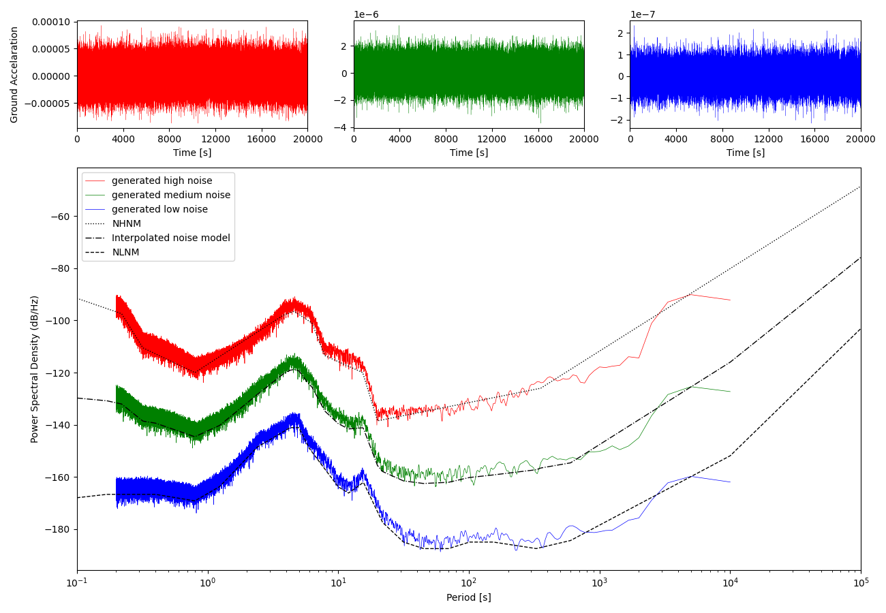

Tools
=====

.. automodule:: pysmo.tools
    :members:
    :undoc-members:
    :show-inheritance:

Subpackages
-----------

.. toctree::

    pysmo.tools.noise

Code Examples
-------------

Noise
~~~~~
In this example two realistic random noise signals are generated and their PSDs are calculated.

.. literalinclude:: ../examples/tools/noise/peterson.py
   :language: python

