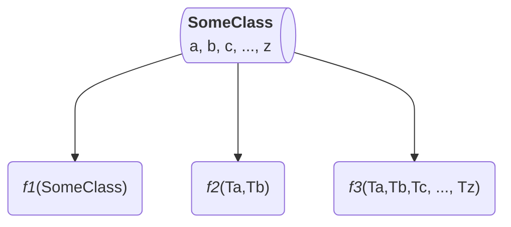
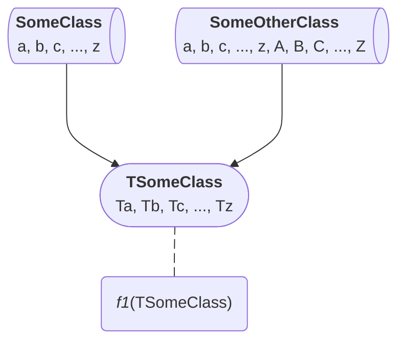
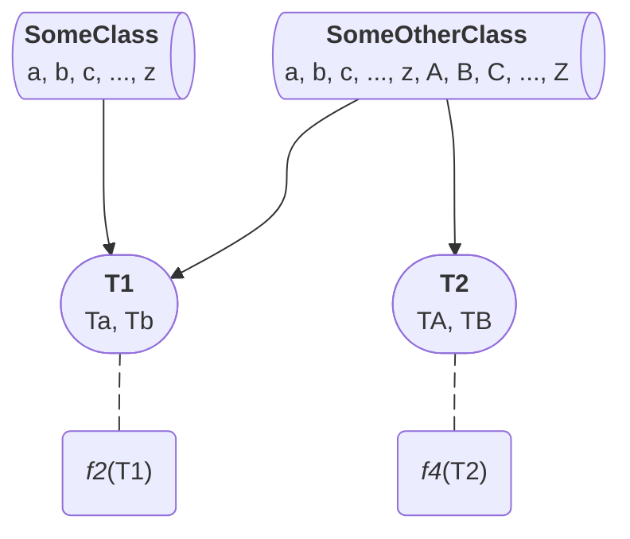
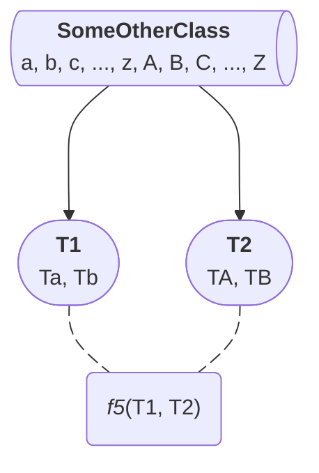
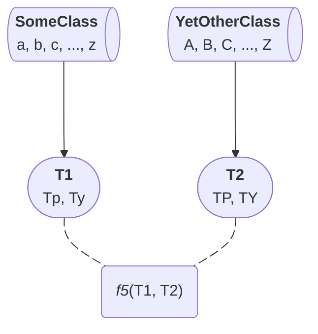

# Types

If you are using pysmo, you are hopefully sold on the idea of using pysmo types
in your code. This section provides some background on how these types came to
be, and what to consider if you want to write some types of your own.

## Use patterns

Defining arbitrarily complex types using [`Protocol`][typing.Protocol] classes
is straightforward, and you may be (or perhaps should be!) tempted to use them
everywhere. However, precisely because it is so easy to write types, you may
want to take a moment to contemplate what exactly should go into the type you
are defining. For this it may be worth looking at different use patterns that
exist for custom types.

!!! note

    For simplicity, we will assume classes only contain attributes in the
    examples shown here. In a real world situation, classes (and types) may of
    course contain methods too.

### Direct access

We begin by discussing the simplest case: no custom types at all. Consider a
class `SomeClass` that has attribute names corresponding to all letters of the
alphabet, i.e. `a`, `b`, `c`, ..., `z`. These data can be used in functions by
passing either the entire class to a function (`f1`), a subset of attributes
(`f2`), or all the individual attributes (`f3`):



Note that in the above diagram, we hint at the types of function arguments
rather than the names. The intention is to show that `f2`, for example, is
meant to be used with attributes `a` and `b` and should therefore be annotated
with the respective types of those attributes. Corresponding (pseudo) code
would look something like:

<!-- skip: next -->

```python
@dataclass
class SomeClass:
  a: float #(1)!
  b: float #(2)!
  c: str
  ...
  z: datetime

def f1(some_class: SomeClass):
  ...

def f2(a: float, b: float):
  ...

def f3(a: float, b: float, c: str, ..., z: datetime):
  ...

```

1. We are now being explicit about the type of `a`, so in the diagram above Ta
   is actually [`float`][].
2. Same for Tb and all other attributes.

Though the function bodies are not shown, we can safely assume that if they are
half decently written, they use all declared function parameters. Thus `f2`
uses only a fraction of the attributes, while `f3` uses all attributes declared in
`SomeClass`. `f2` seems like a reasonable function then; it is simple, it is
clear what data are processed in the function body, and it is decoupled from
`SomeClass` because the attributes are used directly as function parameters.
`f3` is technically also decoupled. However, as all 26 attributes are passed
to the function, there appears to still be a strong link between the two.
Moreover, needing to provide 26 parameters every time `f3` is called seems
unreasonable; it makes more sense to write it like `f1` and pass it an instance
of `SomeClass` directly. As for `f1`, whether or not it is a reasonable
function depends on how many attributes are actually used. If it is a
significant enough amount it makes sense to write the function the way it is.
If only e.g. 2 attributes are used, we might want to write a function that
looks more like `f2`.

### Exact match

As writing types is rather easy, it is worth considering *always* using them.
Doing so immediately makes code more reusable and often more maintainable too.
We can use `SomeClass` as blueprint for the `TSomeClass` type, which is then
used to annotate `f1`. After doing so, we can start using `f1` with the
`SomeOtherClass` class that has the same attributes as `SomeClass`:



Here, `TSomeClass` is not meant to be a "pysmo-like" type. Not much thought
went into it other than "you never know if you use this some other
way one day". But you just might...

### Subset match

Pysmo types are often intended to group related data together. If we find
ourselves writing a lot of functions that use `a` and `b` as input, it is
likely there is a strong connection between those two attributes. They could
be something like the latitude and longitude of an event or station. We can
formally declare this relationship using a new type `T1` and use that in the
`f2` function instead of `a` and `b`. Similarly we define the `T2` type here
and use it for `f4`:



With these types we can seamlessly use `f2` with `SomeClass` as well as
`SomeOtherClass`, while `f4` works with `SomeOtherClass`. Using `T1` and `T2`
as input types for two parameters in yet another function `f5` looks like this:



A slightly odd consequence of using these types is that even though an instance
of `SomeOtherClass` contains all the data needed for `f5`, it has to be passed
to the function twice (once as `T1` and once as `T2`). Thus you might see
something like this appear in your code:

<!-- skip: next -->

```python
some_other_class = SomeOtherClass()
f5(some_other_class, some_other_class)
```

However, this slight drawback is easily offset by the increased flexibility we
gain from using custom types. For example, it is conceivable that `f5` was
originally written for `SomeOtherClass` instances, but now we suddenly find
ourselves in a situation where the data are spread across two different sources
`SomeClass` and `YetOtherClass`(1). Fortunately this isn't an issue thanks to
how types work:
{ .annotate }

1. :bulb: Perhaps you are mixing data sources like files, database queries, web
   requests, etc.



## What should become a type?

Discussing the different patterns above provides insight into some of the
practical aspects of types. However, there are some more fundamental things to
consider when defining types for pysmo. Essentially the idea is to take complex
data, and divide them into sensible smaller pieces (whereby these pieces become
the basis for pysmo types). The single most important thing to keep in mind
while doing so, is that once defined these types should *never* change.

A useful strategy to follow is to determine precisely what data functions
actually need *before* specifying the types (arguably this is how
[`Protocol`][typing.Protocol] is meant to be used in the first place). When
doing so, the functions themselves should be written as general as possible.
For example, a common task is to calculate the distance between an event and a
station. However, that problem can be described more generally as calculating
the distance between two geographic locations. That is exactly why pysmo has
the [`Location`][pysmo.Location] type, which looks like this:

<!-- skip: next -->

```python
--8<-- "src/pysmo/_types/_location.py:location-protocol"
```

Because these types are meant to be very stable, we can do something that is
often considered bad practice: class inheritance. In pysmo the
[`Location`][pysmo.Location] type is reused in the [`Station`][pysmo.Station]
type via inheritance:

<!-- skip: next -->

```python
--8<-- "src/pysmo/_types/_station.py:station-protocol"
```

The result of this is that the [`Station`][pysmo.Station] type gets the
[`latitude`][pysmo.Location.latitude] and
[`longitude`][pysmo.Location.longitude]
attributes from [`Location`][pysmo.Location]. This means
[`Station`][pysmo.Station] classes can be used as input in functions annotated
with [`Location`][pysmo.Location].

In summary, the strategy for determining types can be summarised as follows:

1. Keep types as simple as possible.
2. Reuse simple types whenever possible in more complex types.

!!! tip

    If you ever find yourself contemplating a type with attribute names like
    `station_latitude` or `station_longitude`, you are likely defining a type
    that is too specific.

## Specialised types

The basic types included in pysmo may become insufficient for the more complex
scenarios in the [`pysmo.tools`][] modules. Insisting on only using the basic
[`Seismogram`][pysmo.Seismogram] type would require writing functions with lots
of additional input parameters, therefore becoming tedious to write and use.

This is why some of the components in the pysmo package (e.g.
[`pysmo.tools.iccs`][pysmo.tools.iccs]) use their own types
([`ICCSSeismogram`][pysmo.tools.iccs.ICCSSeismogram]) rather than the basic
pysmo types. Crucially, these types inherit from the basic pysmo types, and
therefore can still be used the same way as e.g. a basic
[`Seismogram`][pysmo.Seismogram].

!!! tip

    These specialised types all have a corresponding
    [mini class](mini-classes.md).
    Thus, if you are working with a class that matches e.g. the
    [`Seismogram`][pysmo.Seismogram] type, but not the
    [`ICCSSeismogram`][pysmo.tools.iccs.ICCSSeismogram] type, you can create a
    [`MiniICCSSeismogram`][pysmo.tools.iccs.MiniICCSSeismogram] object using
    the [`clone_to_mini()`][pysmo.functions.clone_to_mini] function by adding
    the missing attributes via the `update` argument.
