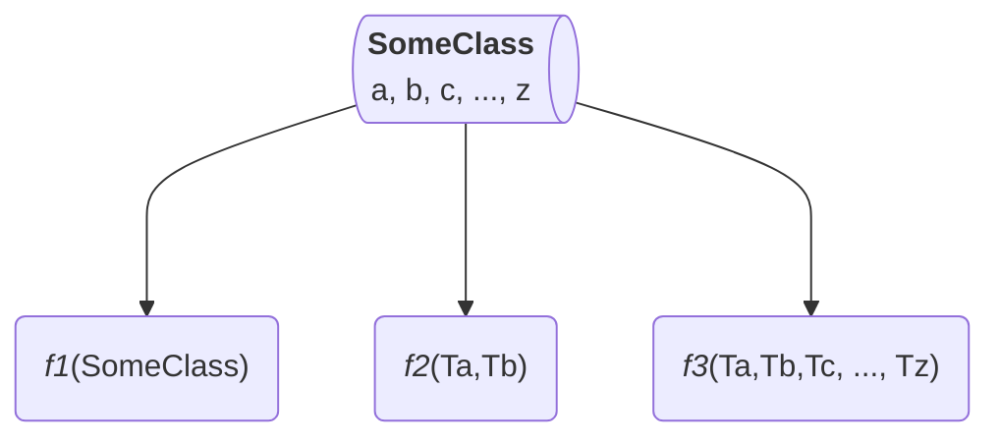
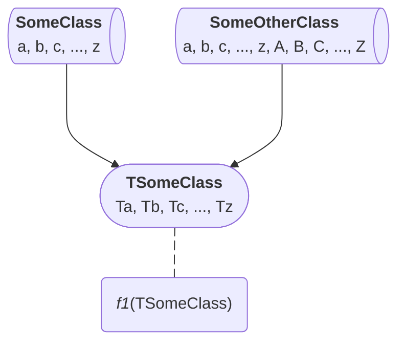
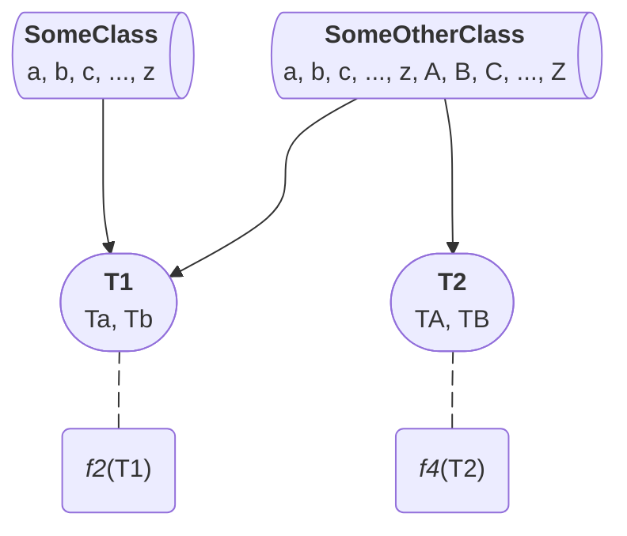
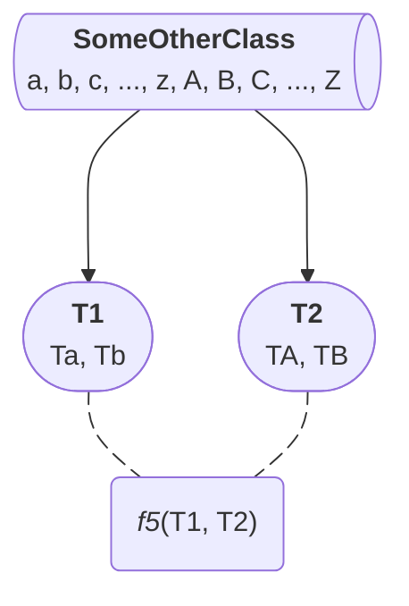
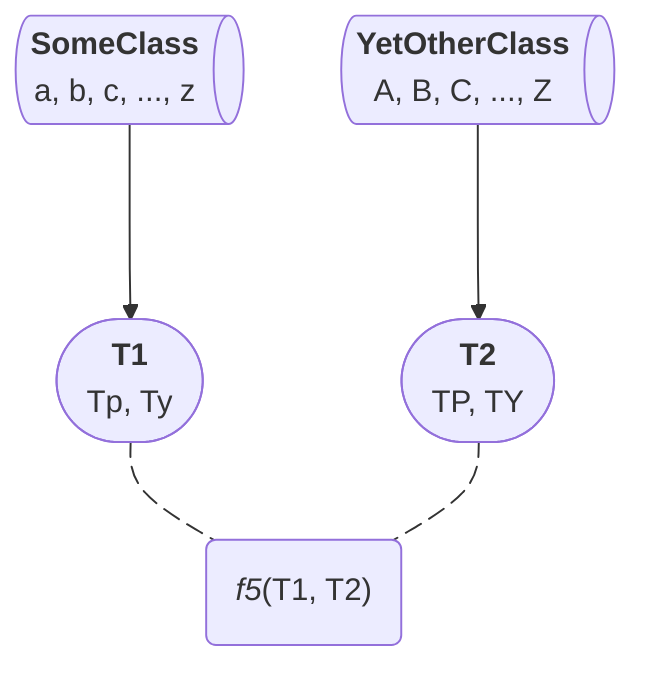

# Types

This section covers how the pysmo types came to be, and what to weigh when
defining new types.

## Use patterns

Defining a type with a [`Protocol`][typing.Protocol] class is easy, which makes
it tempting to define one for everything. That same ease is a reason to stop and
think about what actually belongs in a type. The use patterns below help.

!!! note "Attributes only, for simplicity"

    The examples here assume classes contain only attributes. Real classes and types
    may also contain methods.

### Direct access

Start with the simplest case: no custom types at all. Take a class `SomeClass`
with one attribute for each letter of the alphabet: `a`, `b`, `c`, ..., `z`. Its
data can reach a function in three ways: the whole instance (`f1`), a subset of
attributes (`f2`), or every attribute individually (`f3`):


```mermaid
flowchart TD
    C1@{ shape: das, label: "**SomeClass**
      a, b, c, ..., z" }
    C1 ---> F1@{ shape: rounded, label: "*f1*(SomeClass)" }
    C1 ---> F2@{ shape: rounded, label: "*f2*(Ta,Tb)" }
    C1 ---> F3@{ shape: rounded, label: "*f3*(Ta,Tb,Tc, ..., Tz)" }
```

The diagram labels the function arguments by type, not by name. It shows that
`f2`, for example, is meant for attributes `a` and `b`, so it is annotated with
their types. In (pseudo) code:

<!-- skip: next -->

```python
@dataclass
class SomeClass:
  a: float #(1)!
  b: float #(2)!
  c: str
  ...
  z: datetime

def f1(some_class: SomeClass):
  ...

def f2(a: float, b: float):
  ...

def f3(a: float, b: float, c: str, ..., z: datetime):
  ...

```

1. The type of `a` is now explicit, so `Ta` in the diagram above is [`float`][].
2. Likewise for `Tb` and the rest.

Assume each function body uses all of its declared parameters. `f2` then uses
only a few of the attributes; `f3` uses all of them. `f2` looks reasonable: it
is simple, the data it works on are clear from the signature, and it is
decoupled from `SomeClass` because it takes the attributes directly. `f3` is
decoupled in the same technical sense, but passing all 26 attributes keeps a
strong link to `SomeClass`, and supplying 26 arguments on every call is
impractical. It would be better written like `f1`, taking a `SomeClass`
instance. Whether `f1` itself is reasonable depends on how many attributes it
uses: many, and taking the whole instance is fine; only two or three, and
something like `f2` is better.

### Exact match

Because types are easy to write, one option is to use them *everywhere*. It
makes code more reusable, and often more maintainable. Using `SomeClass` as the
blueprint for a `TSomeClass` type, and annotating `f1` with it, lets `f1` also
accept `SomeOtherClass`, which has the same attributes:


```mermaid
flowchart TD
    C1@{ shape: das, label: "**SomeClass**
      a, b, c, ..., z" }
    C2@{ shape: das, label: "**SomeOtherClass**
      a, b, c, ..., z, A, B, C, ..., Z" }
    T1@{ shape: stadium, label: "**TSomeClass**
      Ta, Tb, Tc, ..., Tz" }
    C1 ---> T1
    C2 ---> T1
    T1 e1@--- F1@{ shape: rounded, label: "*f1*(TSomeClass)" }
    e1@{ animate: true }
```

`TSomeClass` is not a "pysmo-like" type. It was written on the reasoning that
the flexibility might be useful one day. That is rarely a good enough reason:
mirroring a whole class gives a type with no clear concept behind it. The next
pattern is usually the better choice.

### Subset match

Pysmo types usually group related data. Writing many functions that take `a` and
`b` together is a sign those two attributes are connected: they might be the
latitude and longitude of an event or station. A new type `T1` can name that
relationship and replace `a` and `b` in `f2`. A `T2` type does the same for
`f4`:


```mermaid
flowchart TD
    C1@{ shape: das, label: "**SomeClass**
      a, b, c, ..., z" }
    C2@{ shape: das, label: "**SomeOtherClass**
      a, b, c, ..., z, A, B, C, ..., Z" }
    T1@{ shape: stadium, label: "**T1**
      Ta, Tb" }
    T2@{ shape: stadium, label: "**T2**
      TA, TB" }
    C1 ---> T1
    C2 ---> T1
    C2 ---> T2
    T1 e1@--- F2@{ shape: rounded, label: "*f2*(T1)" }
    T2 e2@--- F4@{ shape: rounded, label: "*f4*(T2)" }
    e1@{ animate: true }
    e2@{ animate: true }
```

`f2` now works with both `SomeClass` and `SomeOtherClass`; `f4` works with
`SomeOtherClass`. A third function `f5` can take `T1` and `T2` as two separate
parameters:


```mermaid
flowchart TD
    C2@{ shape: das, label: "**SomeOtherClass**
      a, b, c, ..., z, A, B, C, ..., Z" }
    T1@{ shape: stadium, label: "**T1**
      Ta, Tb" }
    T2@{ shape: stadium, label: "**T2**
      TA, TB" }
    C2 ---> T1
    C2 ---> T2
    T1 e1@--- F5@{ shape: rounded, label: "*f5*(T1, T2)" }
    T2 e2@--- F5
    e1@{ animate: true }
    e2@{ animate: true }
```

One odd consequence: a `SomeOtherClass` instance holds everything `f5` needs,
yet it has to be passed twice, once as `T1` and once as `T2`:

<!-- skip: next -->

```python
some_other_class = SomeOtherClass()
f5(some_other_class, some_other_class)
```

The extra flexibility is worth it. Suppose `f5` was written for
`SomeOtherClass`, but the data later end up split across two sources,
`SomeClass` and `YetOtherClass`(1). The types absorb this with no change to
`f5`:
{ .annotate }

1. :bulb: Perhaps mixing data sources such as files, database queries, and web
    requests.


```mermaid
flowchart TD
    C1@{ shape: das, label: "**SomeClass**
      a, b, c, ..., z" }
    C3@{ shape: das, label: "**YetOtherClass**
      A, B, C, ..., Z" }
    T1@{ shape: stadium, label: "**T1**
      Tp, Ty" }
    T2@{ shape: stadium, label: "**T2**
      TP, TY" }
    C1 ---> T1
    C3 ---> T2
    T1 e1@--- F5@{ shape: rounded, label: "*f5*(T1, T2)" }
    T2 e2@--- F5
    e1@{ animate: true }
    e2@{ animate: true }
```

## What should become a type?

The patterns above show the shapes a type can take. Deciding which to define is
a separate question, and it comes with one hard rule: once defined, a type
should *never* change. That rules out a top-down guess at what a "seismogram" or
a "station" contains. Instead, split the data into small pieces along the lines
the functions actually use.

So the order matters: work out what the functions need first, then define the
types. (This is arguably how `Protocol` is meant to be used.) Write the
functions as generally as possible while doing so. Calculating the distance
between an event and a station, for example, is really the distance between two
geographic locations. That is why pysmo has the [`Location`][pysmo.Location]
type:

<!-- skip: next -->

```python
--8<-- "src/pysmo/_types/location.py:location-protocol"
```

Because these types are meant to be stable, they can use something often
considered bad practice: class inheritance. The [`Station`][pysmo.Station] type
inherits from two smaller types, `Location` and
[`StationCode`][pysmo.StationCode]:

<!-- skip: next -->

```python
--8<-- "src/pysmo/_types/station.py:station-protocol"
```

`Station` then has [`latitude`][pysmo.Location.latitude] and
[`longitude`][pysmo.Location.longitude] from `Location`, and `name`, `network`,
`location`, and `channel` from `StationCode`. A `Station` class can therefore be
passed to any function annotated with `Location` or `StationCode`.

In short:

1. Keep types as simple as possible.
2. Reuse simple types when building more complex ones.

!!! tip "Avoid overly specific attribute names"

    Attribute names like `station_latitude` or `station_longitude` are a sign the
    type is too specific.

## Why does this type exist?

That recipe is not the only route to a type, and the set pysmo ships did not all
follow it. Reading pysmo's own types is easier with that in mind: three distinct
origins emerge, and which one a type has changes what to expect from it.

The first is a **convergence type**: [`Seismogram`][pysmo.Seismogram] is the
clearest example, and is discussed at length in the
["The pysmo solution"](motivation.md#the-pysmo-solution) section of the
motivation page. Here, the problem is that the real world already has too many
competing representations of the same concept: every tool has its own waveform
class. The type's entire purpose is to capture what these representations have
in common, so pysmo can operate on any of them without privileging one or
forcing a conversion. Third-party code is expected to implement types like this
directly; that is the "bring your own class" idea pysmo is built around.

The second is a **converged-concept type**: [`Response`][pysmo.Response] and its
related types ([`ResponseStage`][pysmo.ResponseStage],
[`StagedResponse`][pysmo.StagedResponse]). Here the origin is different. There
is no proliferation of competing in-memory response designs to reconcile. Poles,
zeros, and sensitivity are already the standard, settled way this domain
represents an analogue instrument response. The type names an already-agreed
mathematical object rather than resolving external disagreement. In practice,
hardly anyone hand-implements a new `Response`-conformant class from scratch the
way they might for `Seismogram`; responses come from a small, closed set of
known sources (SAC PZ, StationXML, RESP), and pysmo already ships readers for
those. This type is still physically meaningful in the same way `Seismogram` is,
just extended differently in practice.

The third is an **internal-refactor type**: it exists purely to let a pysmo
function type-check, or to name a slice of behaviour pysmo's own code shares,
not because anything outside pysmo needed naming.
[`StationCode`][pysmo.StationCode] is an example: the network/station/
location/channel identity common to [`Station`][pysmo.Station] and to format
records like [`StationXML`][pysmo.classes.StationXML] that carry NSLC codes
without necessarily carrying coordinates. Nobody has a competing `StationCode`
design in the wild; extracting it is about avoiding duplication in pysmo's own
code, not a response to anything external.

The [`Location`][pysmo.Location]-in-`Station` inheritance described above is the
same "reuse simple types" instinct, applied one step earlier: instead of
factoring out duplication after the fact, `Location` was identified as reusable
from the start.

### Mini classes and root export are separate questions

It is tempting to assume that an internal-refactor type, being the least
"important" of the three, should also be the one that never gets a
[Mini class](mini-classes.md) or never appears in the `pysmo` root namespace.
Neither follows. Both are separate, need-based questions that happen to
correlate with origin without being defined by it.

A `Mini*` class exists only when some real code path needs to construct a bare
instance of exactly that type's fields. An internal-refactor type whose callers
never need a bare, standalone instance gets no `Mini*` class, and that is a fact
about how it is used rather than about its origin.

??? note "Mini-conversion machinery"

    Membership of the internal `_BaseProto`/`_BaseMini` type-alias unions
    (`src/pysmo/__init__.py`), which drive pysmo's generic Mini-conversion machinery
    ([`proto2mini`][pysmo.lib.mini_utils.proto2mini],
    [`matching_pysmo_types`][pysmo.lib.mini_utils.matching_pysmo_types],
    [`clone_to_mini`][pysmo.functions.clone_to_mini],
    [`copy_from_mini`][pysmo.functions.copy_from_mini]), only makes sense once a
    `Mini*` counterpart exists to convert to or from.

Whether a type is exported at the `pysmo` root namespace (importable as
`from pysmo import X`, and therefore listed on the
[API reference](../api/pysmo.md)) is a third, again independent, question. A
type that exists only to type-check one internal call site usually stays
private, following the precedent set by other internal-only helpers such as
`SeismogramEndtimeMixin`.

One more pattern is worth flagging, because it sits next to these three without
being a fourth origin: [`IccsSeismogram`][pysmo.tools.iccs.IccsSeismogram]
*extends* `Seismogram` with extra fields for one algorithm's bookkeeping. It is
internally motivated in the same way an internal-refactor type is, but shaped
the opposite way: adding fields for one tool's needs rather than factoring out
fields shared by several concrete classes. It is not a fourth origin, just a
tool-scoped extension of an existing one, and the
[specialised types](#specialised-types) section returns to it.

## Specialised types

The basic types can fall short of the more complex scenarios in the
[`pysmo.tools`][] modules. Sticking to the basic
[`Seismogram`][pysmo.Seismogram] type there would mean functions with many extra
parameters, tedious to write and to call.

[`IccsSeismogram`][pysmo.tools.iccs.IccsSeismogram], used throughout
[`pysmo.tools.iccs`][pysmo.tools.iccs], is one such type. As the section above
notes, it *extends* `Seismogram` rather than replacing it, so an
`IccsSeismogram` still works anywhere a plain `Seismogram` is expected.

!!! tip "Mini classes for specialised types"

    Each specialised type has a corresponding [mini class](mini-classes.md). A class
    that matches `Seismogram` but not `IccsSeismogram` can be turned into a
    [`MiniIccsSeismogram`][pysmo.tools.iccs.MiniIccsSeismogram] with
    [`clone_to_mini()`][pysmo.functions.clone_to_mini], supplying the missing
    attributes through the `update` argument.
