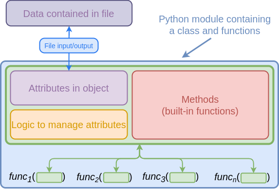
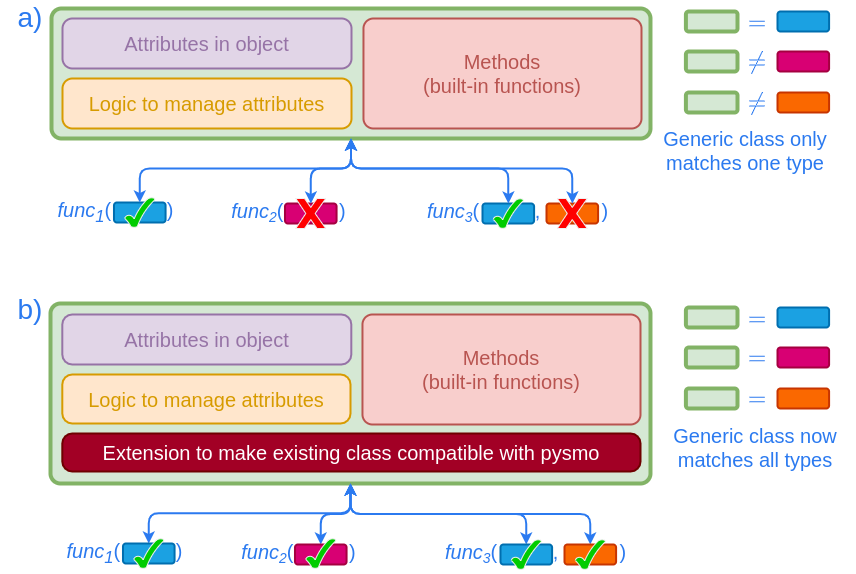

# Classes

The types discussed in the [previous chapter](/user-guide/types/) are only
useful in conjunction with compatible classes. The pysmo package contains
classes that work with pysmo types (in the [`pysmo`][pysmo] and
[`pysmo.classes`][pysmo.classes] namespaces). Here we discuss how to write your
own classes that work with pysmo types.

## Writing compatible classes

A class is is compatible with a particular type if all attributes and methods
present in the type (defined by the respective protocol class) are also present
in the class itself. For example, a `City` class may look something like this:

```python title="city.py"
--8<-- "docs/snippets/city.py"
```

As the `City` class has `latitude` and `longitude` attributes, an instance of it
is also an instance of the [`Location`][pysmo.Location] type:

<!-- termynal -->

```bash
$ python -i city.py
>>> from pysmo import Location
>>> nyc = City(name='New York', founded='1624', \
               latitude=40.7, longitude=-74, elevation=10)
>>> isinstance(nyc, Location)
True
```

This example also illustrates that a class may contain additional attributes
and methods that are not part of the type definition. In fact, a class may even
match multiple types. Classes may therefore be essentially arbitrarily complex
and still work with pysmo types as long as the necessary attributes are
present.

!!! warning

    In cases where a class contains additional attributes or methods, we
    strongly suggest to never access these in e.g. a function using pysmo
    types as input. For example, the code below will run if the `city` input
    is an instance of the `City` class (because it has the `name` attribute).
    However, the `name` attribute may not be present in another class that
    matches the [`Location`][pysmo.Location] type, resulting in a runtime
    error when this function is called.

    ```python
    # Do not do this!
    def print_coordinates(city: Location) -> None:
       print(f"The coordinates of {city.name} are: {city.latitude}, {city.longitude}")
    ```

## Pysmo Mini Classes

The `City` example above illustrates how easy it is to write a class that is
compatible with functions that expect pysmo types as input. However, this is
not necessary if the data do not require a class with attributes that exceed
pysmo types. For such cases the pysmo package includes "Mini" classes that
correspond to each type (e.g. for the [`Location`][pysmo.Location] type there
is a [`MiniLocation`][pysmo.MiniLocation] class).

## Using pysmo with existing classes

Recall that pysmo types are aimed at the processing side of things, and not
data storage. Consequently, pysmo is not centered around a "native" file format
or Python class (and the Mini classes or not meant to be understood as such).
The preferred approach is to use existing classes and modify them to work with
pysmo instead.

### Anatomy of a class

A typical third party module that reads data from files and uses its own
specific class for both data storage and processing will likely look something
like this:

<figure markdown>
  { loading=lazy }
  <figcaption>
    Relationship between Python objects and files storing data.
  </figcaption>
</figure>

Here, the Python class has many responsibilities; it needs to manage file input
and output, data consistency (e.g. if changing one attribute means another one
also needs to be changed), and process data via methods. The Python module may
also contain functions that use instances of the class as inputs.

These kinds of Python classes can be quite sophisticated, and often become the
centrepieces of Python packages. As one might imagine, writing and maintaining
these classes is a lot of work, and it does not make much sense to create yet
another one for pysmo.

### Extending an existing class

In order to make use of these existing classes, we must ensure compatibility
with the pysmo [types](../types). While some types may work out of the box
with an existing class, it is usually necessary to modify the class to work
with pysmo types. Crucially, this requires only a fraction of work compared to
writing these kinds of classes from scratch.

<figure markdown>
  { loading=lazy }
  <figcaption>
    (a) An existing generic class may well contain the exact data that are used
    as input for functions. However, as the functions expect those data to be
    presented in a particular way (i.e. they need to match pysmo types), the
    class is mostly incompatible. (b) After extending the generic class
    (typically simply by mapping attributes in the class to attributes in the
    type via aliases) it becomes compatible with more pysmo types, and thus can
    be used for all the functions.
  </figcaption>
</figure>

## The SAC Classes

[SAC](<https://ds.iris.edu/ds/nodes/dmc/software/downloads/sac/>) (Seismic
Analysis Code) is a commonly used program that uses its own file format. Pysmo
was initially conceived as a small project to read and write SAC files using
Python. This was done with the [`SacIO`][pysmo.lib.io.SacIO] class, which is
still part of the pysmo package. However, it is not compatible with pysmo
types, and is therefore not intended to be used directly anymore. It now serves
as base for the [`SAC`][pysmo.classes.SAC] class, which adds a compatibility
layer that enables using pysmo types. We can therefore use the SAC classes as
an example of how to adapt existing third party classes to work with pysmo
types.

### Adding attributes to the [`SacIO`][pysmo.lib.io.SacIO] class

The [`SacIO`][pysmo.lib.io.SacIO] class allows us to create objects from SAC
files, which we can then access in Python:

```python title="read_sacfile.py"
--8<-- "docs/snippets/read_sacfile.py"
```

After creating [`SacIO`][pysmo.lib.io.SacIO] objects, SAC data and header
fields can be accessed using the same names as used in the SAC file format (in
lowercase). For example for the station location:

<!-- termynal -->

```bash
$ # Start an interactive python shell after executing read_sacfile.py:
$ python -i read_sacfile.py
>>> print(f"Station latitude: {my_sac.stla:.2f}")
Station latitude: -48.47
>>> print(f"Station longitude: {my_sac.stlo:.2f}")
Station longitude: -72.56
>>>
```

These attributes have the correct format, but not the right name for the pysmo
[`Location`][pysmo.Location] type:

<!-- termynal -->

```bash
$ python -i read_sacfile.py
>>> from pysmo import Location
>>> isinstance(my_sac, Location)
False
>>>
```

What is needed is a way to access existing attributes via different names that
correspond to the attributes expected by pysmo types. This can be done quite
easily by creating a new class which inherits from the original one:

```python title="read_sacfile2.py"
--8<-- "docs/snippets/read_sacfile2.py"
```

1. `STLA` and `STLO` are optional header fields in a SAC file. However, the
  [`Location`][pysmo.Location] type requires the
  [`latitude`][pysmo.Location.latitude] and
  [`longitude`][pysmo.Location.longitude] attributes to be [`floats`][float]
  (i.e. they may not be of type [`None`][None]).

Objects created from this new class can do everything the
[`SacIO`][pysmo.lib.io.SacIO] class can do, while also matching the
[`Location`][pysmo.Location] type. Changing the mapped attributes will also
change the original ones:

<!-- termynal -->

```bash
$ python -i read_sacfile2.py
>>> from pysmo import Location
>>> isinstance(my_sac2, Location)
True
>>> my_sac2.latitude = -12.3
>>> my_sac2.stla
-12.3
>>>
```

With just a few lines of code we were able to make the
[`SacIO`][pysmo.lib.io.SacIO] class (itself over 1000 lines of code) compatible
with the [`Location`][pysmo.Location] type. That said, creating new attributes
directly and mapping them to existing ones may not always be possible for large
classes like [`SacIO`][pysmo.lib.io.SacIO]. For example, the event location is
also stored in the headers of a SAC file, but we can't map it to the `latitude`
and `longitude` attributes because they are already used for the station
location. A more flexible approach is to map attributes into helper classes,
which themselves are attributes in a new class.

!!! tip

    In case you are asking yourself why you would want to go through this extra
    step of making a class work with pysmo types instead of writing functions
    that directly use the original class - consider that the number of
    functions will almost always be much greater than the number of classes.
    You may well be using the same class with 200 different functions, and if
    that class were to change for some reason (or you decide to use a different
    one entirely), all 200 functions may need to be edited to accomadate the
    changes. Conversely, extending these classes to work with pysmo types means
    that in the event the original class changes, only the code that does the
    extending would need to be edited, while all 200 functions can stay the
    same.

### SAC helper classes

Because SAC files have a large number of header fields,
[`SacIO`][pysmo.lib.io.SacIO] objects have the potential to match several
different pysmo types (or the same type multiple times). For the actual
implementation of the above principle in the [`SAC`][pysmo.classes.SAC] class
packaged in pysmo, we therefore use helper classes to provide a clear way to
distinguish between types and avoid mapped attributes clashing with each other.
This is best illustrated with a simple example:

```python
>>> from pysmo import Seismogram, Station
>>> from pysmo.classes import SAC
>>> my_sac = SAC.from_file("testfile.sac")
>>> isinstance(my_sac.seismogram, Seismogram) # (1)!
True
>>> isinstance(my_sac.station, Station) # (2)!
True
>>>
```

1. `my_sac.seismogram` is an instance of
  [`SacSeismogram`][pysmo.classes.SacSeismogram] and is therefore
  compatible with the [`Seismogram`][pysmo.Seismogram] type.
2. `my_sac.station` is an instance of
  [`SacStation`][pysmo.classes.SacStation] and is therefore compatible with
  the [`Station`][pysmo.Station] type.
