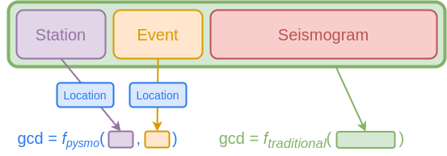
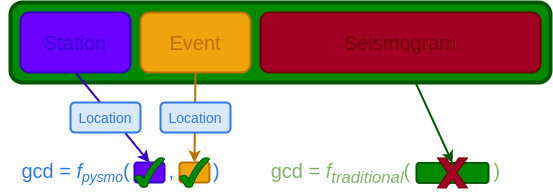
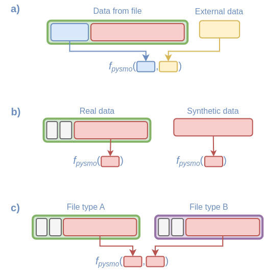

# Types

In the previous section we briefly [mention](../introduction#type-tip) that
every time we define a class in Python, we also define a type. As these types
may be structures containing other types (e.g. an array containing floats) they
can be arbitrarily complex. We can therefore conveniently group any data into
an object to store and process them(1). However, the best way to structure such
an object for storage may often be at odds with the best way for processing.
Thus, a Python type that is well suited for storing seismological data is
sometimes not a good type for processing (and vice-versa). Pysmo avoids having
to deal with this discrepancy by using different types for storing and
processing data.
{ .annotate }

1. :bulb: Remember that objects are instances of a class.

The types used for storing data are the generic classes you may be used to
using, whereas the types used for processing data are protocol classes. This
may sound a bit confusing at first, but it is a simple matter of understanding
the following points:

1. Protocol classes themselves do not provide any functionality, thus the
  objects we pass as input to a function are indeed still instances of generic
  classes.
2. The purpose of protocol classes is to provide a mechanism to define
  constraints on the generic classes.
3. In order to use a generic class as input for a function that uses protocol
  classes in its type hints, the generic class must be a *subclass* of of the
  protocol class. You can therefore think of a protocol class as a sort of
  placeholder, which is substituted by a generic class when code is executed.

This chapter aims to explain the above points in greater detail, and to
hopefully convince you that doing things this way is indeed a good idea!

## Protocol Classes

[`Protocol`][typing.Protocol] classes were introduced in Python 3.8, and are
discussed in detail in [PEP 544](https://peps.python.org/pep-0544/). In this
section, we explain why and how they are used in pysmo.

### Why Protocol Classes?

In natural sciences we often process data that exist in one form or another in
the physical world. We are of the opinion that Python types used for these data
should not just be an arbitrary and abstract thing, but rather something that
captures the essence of the data we are working with as they exist in nature.
Of course, there are always going to be some abstractions. These already occur
at the "pen and paper" stage, where we initially formulise problems, define
models parameters etc. Pysmo types are defined with this early stage in mind.
This makes it a lot easier to go from defining a problem, to coming up with a
strategy or algorithm, to finally writing computer code. How these types are
implemented is largely irrelevant at this early stage. Protocol classes are
precisely for this use case - defining a type without implementing it.

### How they work as pysmo types

Let's see how to use protocol classes in pysmo with some example code that
calculates the great circle distance (gcd) between the location of a station
and an event source in two different ways: the *traditional* way, and the
*pysmo* way. For the traditional approach we use the same data class(1) for
both storage and processing. For the pysmo approach, we also use that data
class for storage, but use pysmo types for processing instead.
{ .annotate }

1. In this discussion "data classes" simply refers to a class containing
    (seismological) data, and not the Python [dataclass][dataclasses.dataclass].

For our example we assume the data we want to process is stored in a
[sac](https://ds.iris.edu/files/sac-manual/manual/file_format.html) file called
`example.sac`. Such files can be read in pysmo using the
[`SAC`][pysmo.classes.SAC] class. The following code shows what the traditional
way might look like:

```python title="gcd_traditional.py"
--8<-- "docs/snippets/gcd_traditional.py"
```

1. For this example we use the pyproj module for the distance calculation.
2. The [`SAC`][pysmo.classes.SAC] class gives us access to the header fields in
  sac files using their respective names as attributes.
3. Because the SAC variables for station and event coordinates are optional
  headers in the sac file file format, we cannot assume they contain values.
  Thus, we check they all contain valid data before continuing.
4. `g.inv()` returns azimuth, backazimuth, and distance. We use the single
  underscore (`_`) variable to indicate we are not interested in azimuth and
  backazimuth.

There are two things to note about the code above:

1. When we think of sac files, we consider station and event information to be
  merely *metadata* for the included seismogram. Because of that there is an
  apparent disconnect between the purpose of the function (calculating gcd -
  an operation that requires coordinates) and the type of input variable.
  Consequently the above code may be difficult to understand without solid
  knowledge of the sac format.
2. We must also deal with the idiosyncrasies of the sac file format. In this
  instance with the fact that very few of the many header fields are mandatory.

The same example code, but using pysmo types instead would look like this:

```python title="gcd_pysmo.py" hl_lines="28 29"
--8<-- "docs/snippets/gcd_pysmo.py"
```

<!-- skip: next -->
1. One of the pysmo types is [`Location`][pysmo.Location], which is a simple
  protocol class with two attributes `latitude` and `longitude`. We use this
  class for the type hints in our function.
1. The [`SAC`][pysmo.classes.SAC] class directly mirrors the structure of sac
  files, and as such would not work with pysmo types without some additional
  attributes to extend the functionality of the class. Two such attributes are
  [`event`][pysmo.classes.SAC.event] and
  [`station`][pysmo.classes.SAC.station], which provide access to data stored in
  a sac file in a way that does work with pysmo types. For the purposes of this
  example, we can verify that these attributes are indeed subclasses (and thus
  instances) of the desired pysmo types:

    ```python
    >>> isinstance(my_seismogram.event, Location)
    True
    ```

At a first glance the two scripts look quite similar. The function `f_pysmo`
is simpler and more concise than `f_traditional`, but there is a bit of extra
work involved before we call the function (the highlighted lines). Most
importantly though, `f_pysmo` is a function that calculates the gcd from a
much simpler and more meaningful input, which leads to the function as a whole
being more intuitive and easier to understand.

We can also illustrate the different ways the functions interact with
[`SAC`][pysmo.classes.SAC] objects in the two scripts graphically (note that we
ignore all header fields unrelated to station or event data in the figure):

<figure markdown>
  { loading=lazy }
  <figcaption>
    A simplified SAC object (shown in light green) contains within it station
    data (light purple), event data (light yellow), and a seismogram (light
    red). Instead of consuming the entire data class, pysmo functions (via
    protocol classes) only use the information they actually need for a
    calculation and ignore the rest. Here the Station and Event both match the
    Location type (light blue), and can therefore be used as input for the
    f<sub>pysmo</sub> function. The f<sub>traditional</sub> function was
    specifically written for SAC objects, so naturally only accepts those as
    input.
  </figcaption>
</figure>

Hopefully the above example convincingly demonstrates how pysmo types aid in
writing and understanding code. Another benefit of using pysmo types is their
stability; much like we can expect for something like a [`float`][float], pysmo
types are unlikely to ever need to change (because they are kept as simple as
possible). This can't necessarily be guaranteed for something like the sac file
format. If that happens, the structure of the [`SAC`][pysmo.classes.SAC] class
may also need to change and `f_traditional` breaks:

<figure markdown>
  { loading=lazy }
  <figcaption>
    Because a different format is being used (represented by dark colours instead
    of light), the function f<sub>traditional</sub> no longer is able to perform
    the calculation. The pysmo function f<sub>pysmo</sub> still works, provided
    the new station and event information format also still match the Location
    protocol.
  </figcaption>
</figure>

Furthermore, working with pysmo types also opens up interesting ways of working
with seismological data. We illustrate some below:

<figure markdown>
  { loading=lazy }
  <figcaption>
    Examples of how pysmo functions can be used in novel ways: (a) If a
    function needs data that is not present in a file format, the file can be
    used in combination with external data (e.g. stored in a database) to
    perform the computation. (b) Using synthetic seismograms with pysmo
    functions is straightforward, as there is no need to add all the extra
    (meta)data to turn it into a particular file format for further use. (c)
    Functions can directly use data from different file types in the same
    function.
  </figcaption>
</figure>

## Editor support

At this point is worth repeating that type hints in Python are not enforced at
runtime. They are therefore most useful when used together with a modern editor
capable of interpreting these type hints. Typically this happens in the form
of autocomplete and error checking.

### Autocomplete

Once [installed](../first-steps/installation.md), the pysmo types can be
imported and used just like any class. We can, for example, use the
[`Seismogram`][pysmo.Seismogram] type to annotate a function. A modern editor
is then able to tell us what attributes are available for a variable and speed
up the coding process by offering autocomplete for the attributes:


### Error Checking

Should we for some reason make coding errors such as trying to access a
none-existing attribute, the editor will give us a warning:

{ loading=lazy }
{ loading=lazy }

These kinds of warnings are not just for catching typos. They will also catch
programming errors such as trying to set the value of `delta` to a string
instead of a float.

!!! tip
    Should your editor for some reason be unable to parse type hints, testing
    your code for typing errors can still be done with
    [mypy](https://mypy.readthedocs.io/en/stable/) by running:

    ```bash
    $ python -m mypy mycode.py
    ```

## Rules of the land

Wether you plan on only using pysmo types, or if you also want to write your
own (in which case please consider submitting them for inclusion in the pysmo
package), it is important to understand the rules used when they are declared.

### What kind of data should be part of a type?

In short, a pysmo type should represent something that can (for the most part)
be independently measured or observed, rather than being derived from some
other type of data. The aim of this rule is to prevent ambiguous relationships
between class attributes leading to inconsistencies creeping into data.
Occasionally  this means we need to decide which attributes are more important.
For example, the [`Seismogram`][pysmo.Seismogram] type has `begin_time` and
`delta` attributes. Using these two together with the length of the seismogram
(number of samples), we can calculate the end time of the seismogram. For
convenience there is actually also a `end_time` attribute in the type, but it
is read-only. Were it also writable, changing its value would require updating
the `begin_time` or the `delta` attribute. There is no way to know which one to
update (or even both?), and we might also introduce rounding errors.

We must consider the same thing not just for type attributes, but also for the
types themselves. In the example above we calculate the great circle distance
(gcd) from two [`Location`][pysmo.Location] objects. There may be some ways to
measure the gcd directly, but most likely it will be derived from coordinates.
Therefore, gcd cannot be a pysmo type (or writable type attribute).

### Units

All units should be SI units. Points in time should be
[`datetime`][datetime.datetime] objects (in UTC), and time deltas
[`timedelta`][datetime.timedelta] objects.

### Avoid declaring methods

While protocol classes certainly allow for methods to be declared, they do not
make much sense for how protocol classes are used in pysmo. A pysmo type should
declare what a thing *is*, not what it can do.

### Avoid allowing attributes to be [`None`][None]

In most cases, allowing attributes to be [`None`][None] means the types become
meaningless. For example, a [`Location`][pysmo.Location] where coordinates are
optional doesn't really make sense.

### Reuse existing types

As the protocols contain only the typing structure, pysmo types can quite
easily inherit from each other. If a new type were to contain all attributes of
an existing type, that existing type should be reused. This is used in e.g. the
[`Station`][pysmo.Station] type - a station requires coordinates, and we
therefore inherit the [`Location`][pysmo.Location] type in the class
definition:

```python title="pysmo/_types/_station.py" hl_lines="2"
--8<-- "pysmo/_types/_station.py:9:12"
```

!!! tip

    This strategy means [`Station`][pysmo.Station] objects are also instances
    of [`Location`][pysmo.Location]. We can therefore write more generic
    functions (e.g. a function that calcluates gcd not just for a specific
    type of seismogram object, but any two objects containing locations), while 
    simultaniously being very specific about type of input requried by the
    functions.

### Specialised Types

The basic types included in pysmo are not exclusively derived from whatever it
is they represent in the physical world. Because they define the interface used
for interoperability between different parts of code, they are also influenced
by the requirements of the code itself (arguably this is what protocols are
really all about).

This is worth remembering when dealing with algorithms with very specific data
requirements. One of the principles of pysmo is that e.g. a function should be
asking for the exact type of data it needs, rather than having to deal with
whatever the structure of the data provided is. For example, if we need a
special type of [`Seismogram`][pysmo.Seismogram] that also needs a plethora of
extra attributes for processing, we should not have to pass those attributes as
arguments to a function. Instead, we should create a new type that contains
those attributes.

This is why some of the components in the pysmo package
(e.g. [`pysmo.tools.iccs`][pysmo.tools.iccs]) use their own types
([`ICCSSeismogram`][pysmo.tools.iccs.ICCSSeismogram]) rather than the basic
pysmo types. Crucially, these types inherit from the basic pysmo types, and
therefore can still be used the same way as e.g. a basic
[`Seismogram`][pysmo.Seismogram].

!!! tip

    These specialised types all have a corresponding
    [mini class](/user-guide/classes#pysmo-mini-classes).
    Thus, if you are working with a class that matches e.g. the
    [`Seismogram`][pysmo.Seismogram] type, but not the
    [`ICCCSeismogram`][pysmo.tools.iccs.ICCSSeismogram] type, you can create a
    [`MiniICCSSeismogram`][pysmo.tools.iccs.MiniICCSSeismogram] object using
    the [`clone_to_mini()`][pysmo.functions.clone_to_mini] function by adding
    the missing attributes via the `update` argument.
